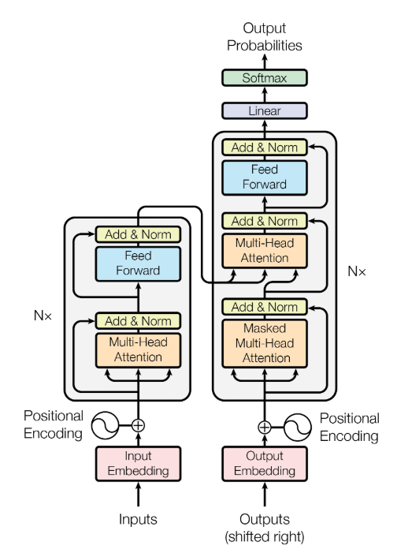
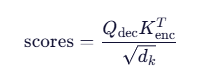
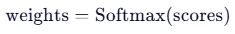
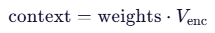

#### 2.Transformer架构

---

##### 1.特点：并行化训练和强大的长距离依赖建模能力

| 模型 | 问题                                   |
| ---- | -------------------------------------- |
| RNN  | 顺序计算，无法并行；长距离依赖梯度消失 |
| CNN  | 局部感受野，捕捉长距离依赖需多层堆叠   |

##### 2.Encoder-Decoder架构




##### **Encoder-Decoder Attention 详解**

---

这是 Transformer 模型中**连接编码器与解码器的关键桥梁**，它让解码器在生成每个词时，能够“回头看”编码器对输入序列的完整理解。

##### （1）. **Query (Q) 来自 Decoder**

- 是 Decoder 当前状态的表示
- 表示：“我现在在写什么？我在找什么信息？”
- 来源：Decoder 的上一层输出（经过 Masked Self-Attention 后）

##### （2）. **Key (K) 和 Value (V) 来自 Encoder**

- **K**：Encoder 输出的表示，表示“我能提供什么信息”
- **V**：Encoder 输出的表示，表示“我的实际信息内容”
- 来源：Encoder 的最终输出（所有层之后）

##### （3）. **计算注意力分数**




- *Q*dec：Decoder 的查询矩阵，形状 `(target_seq_len, d_k)`
- *K*enc：Encoder 的键矩阵，形状 `(source_seq_len, d_k)`
- 结果：`(target_seq_len, source_seq_len)`，即**对齐矩阵**

##### （4）. **Softmax 归一化**



- 每一行是一个概率分布，表示 Decoder 的每个位置对 Encoder 所有位置的注意力权重

##### （5）. **加权求和得到上下文向量**



- *V*enc：Encoder 的值矩阵，形状 `(source_seq_len, d_v)`
- 输出：`(target_seq_len, d_v)`，即融合了输入信息的上下文表示

（6）可视化示例

##### 任务：英译法 `"I love NLP" → "J'aime le TALN"`

##### Encoder 输出（K, V）：

| 位置 | 词   | 向量表示 |
| ---- | ---- | -------- |
| 1    | I    | h₁       |
| 2    | love | h₂       |
| 3    | NLP  | h₃       |

##### Decoder 生成过程：

| 生成词   | Query (Q) | Attention Weights (对 h₁,h₂,h₃) | 解释                     |
| -------- | --------- | ------------------------------- | ------------------------ |
| `J'aime` | q₁        | [0.1, 0.8, 0.1]                 | 主要关注 "love"          |
| `le`     | q₂        | [0.7, 0.2, 0.1]                 | 关注 "I"（冠词对应）     |
| `TALN`   | q₃        | [0.1, 0.1, 0.8]                 | 主要关注 "NLP"           |
| `<eos>`  | q₄        | [0.05, 0.05, 0.9]               | 强烈关注 "NLP"，准备结束 |

```
注意力对齐矩阵（Alignment）：

        I     love    NLP
J'aime  0.1    0.8     0.1
le      0.7    0.2     0.1
TALN    0.1    0.1     0.8
<eos>   0.05   0.05    0.9
```

