# 非线性优化

## 前置知识

---

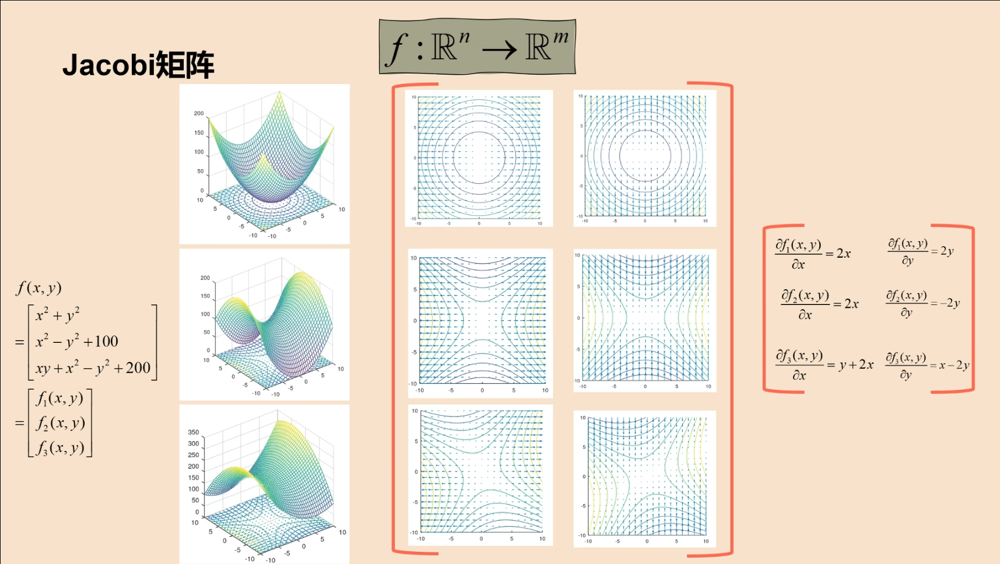

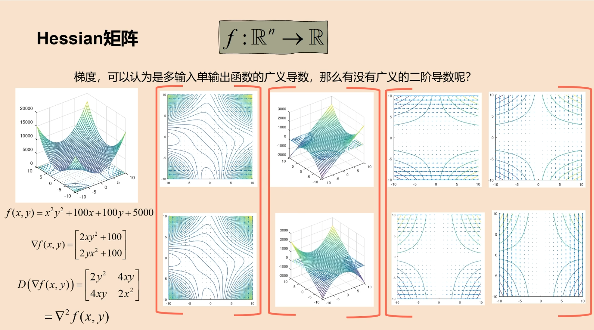

---

## 一.基本形式

一个标准的非线性优化问题可表示为：

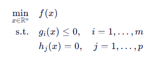

其中：

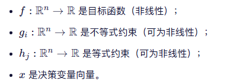

## 二.分类

根据问题结构，非线性优化可分为：

1. ##### **无约束非线性优化**：没有约束条件，仅最小化 *f*(*x*)。

2. ##### **有约束非线性优化**：包含等式或不等式约束。

3. ##### 凸 vs 非凸：

   - 若 *f* 是凸函数，且可行域是凸集（即 *g**i* 为凸函数，*h**j* 为仿射函数），则称为**凸非线性优化**，具有全局最优解的良好性质。
   - 否则为**非凸优化**，可能存在多个局部极小值，求解更困难。

## 三.常用求解方法

---

### 一维搜索：

#### 二分法：

​	在非线性优化的一维搜索（line search）中，**二分法**（Bisection Method）通常用于求解导数为零的点（即寻找一维函数的极小值点），前提是目标函数在区间上是**单峰**（unimodal）且**可导**的。此时我们可以对导函数使用二分法来找其零点。

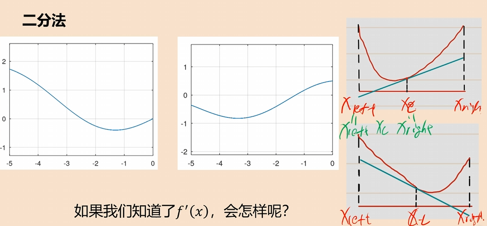

代码示例

```c++
#include <iostream>
#include <cmath>
#include <functional>

// 二分法求一维函数极小值点（通过导数零点）
double bisection_line_search(
    std::function<double(double)> df,   // 导函数 f'(x)
    double a,                           // 区间左端点，需满足 df(a) < 0
    double b,                           // 区间右端点，需满足 df(b) > 0
    double tol = 1e-8,                  // 容差
    int max_iter = 100                  // 最大迭代次数
) {
    if (df(a) >= 0 || df(b) <= 0) {
        throw std::invalid_argument("Invalid interval: require df(a) < 0 and df(b) > 0.");
    }

    double left = a, right = b;
    for (int i = 0; i < max_iter; ++i) {
        double mid = (left + right) / 2.0;
        double d_mid = df(mid);

        if (std::abs(d_mid) < tol) {
            return mid;  // 找到近似驻点
        }

        if (d_mid > 0) {
            right = mid;  // 零点在左侧
        } else {
            left = mid;   // 零点在右侧
        }

        if (right - left < tol) {
            return (left + right) / 2.0;
        }
    }

    // 达到最大迭代次数仍未收敛，返回当前中点
    return (left + right) / 2.0;
}

// 示例：f(x) = (x - 2)^2 + 3，极小值在 x=2
double example_df(double x) {
    return 2.0 * (x - 2.0);  // f'(x)
}

int main() {
    try {
        double a = 0.0, b = 5.0;
        double x_min = bisection_line_search(example_df, a, b);
        std::cout << "Approximate minimizer: x = " << x_min << std::endl;
        std::cout << "f'(x_min) = " << example_df(x_min) << std::endl;
    } catch (const std::exception& e) {
        std::cerr << "Error: " << e.what() << std::endl;
    }
    return 0;
}
```

---

#### 牛顿法：

​	在一维搜索（line search）中，**牛顿法**（Newton's Method）是一种利用目标函数的一阶导数和二阶导数信息来快速逼近极小值点的迭代方法。其核心思想是：在当前点处对目标函数进行二阶泰勒展开，并求该二次近似函数的极小值点作为下一次迭代的位置。

​	设目标函数为 *f*(*x*)，我们希望最小化它。
 牛顿迭代格式为：

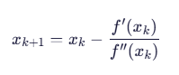

**要求**：

- *f* 二阶可导；
- *f*‘’(xk)>0（保证是局部极小而非极大或鞍点）；
- 初始点 *x*0 足够接近极小值点（牛顿法是局部收敛的）。

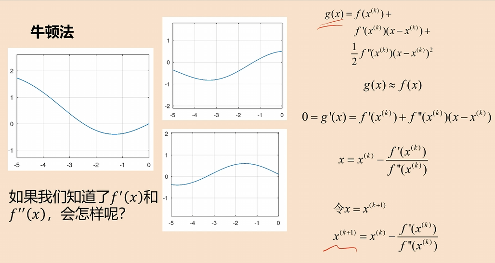

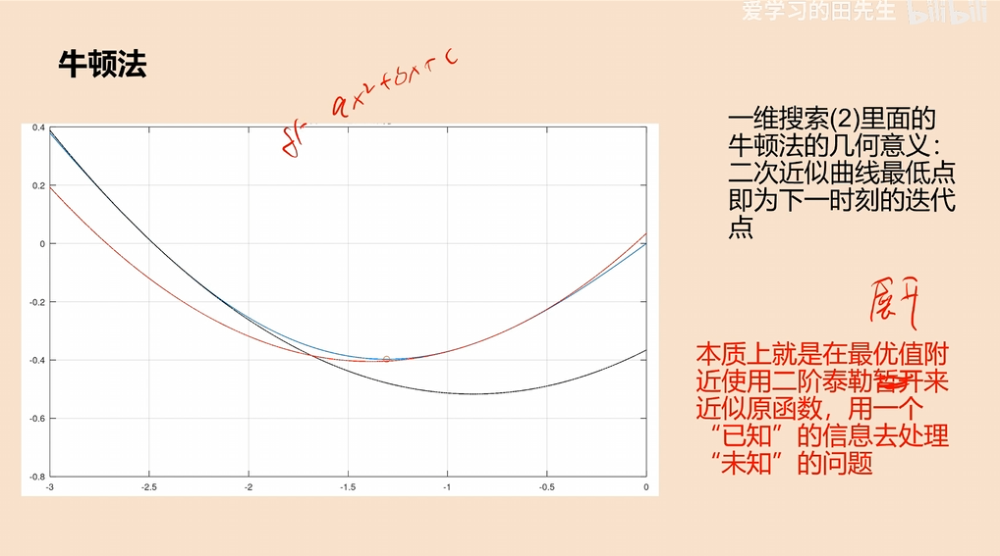

```c++
#include <iostream>
#include <cmath>
#include <functional>

// 牛顿法进行一维优化（寻找极小值点）
double newton_line_search(
    std::function<double(double)> df,        // 一阶导数 f'(x)
    std::function<double(double)> d2f,       // 二阶导数 f''(x)
    double x0,                               // 初始猜测点
    double tol = 1e-8,                       // 收敛容差
    int max_iter = 50                        // 最大迭代次数
) {
    double x = x0;

    for (int i = 0; i < max_iter; ++i) {
        double grad = df(x);
        double hess = d2f(x);

        // 检查二阶导数是否为正（确保是极小方向）
        if (hess <= 0) {
            throw std::runtime_error("Hessian is non-positive at x = " + std::to_string(x) +
                                     ". Newton method not suitable here.");
        }

        double step = grad / hess;
        double x_new = x - step;

        // 检查收敛性（基于步长或梯度）
        if (std::abs(step) < tol || std::abs(grad) < tol) {
            return x_new;
        }

        x = x_new;
    }

    // 若未收敛，仍返回当前结果（可选警告）
    std::cerr << "Warning: Newton method did not converge within " << max_iter << " iterations.\n";
    return x;
}

// 示例：f(x) = (x - 3)^4 + 2*(x - 3)^2 + 5
// 极小值在 x = 3
double example_df(double x) {
    double t = x - 3.0;
    return 4 * t * t * t + 4 * t;  // f'(x)
}

double example_d2f(double x) {
    double t = x - 3.0;
    return 12 * t * t + 4;         // f''(x) > 0 always
}

int main() {
    try {
        double x0 = 0.0;  // 初始点
        double x_min = newton_line_search(example_df, example_d2f, x0);
        std::cout << "Approximate minimizer: x = " << x_min << std::endl;
        std::cout << "f'(x_min) = " << example_df(x_min) << std::endl;
        std::cout << "f''(x_min) = " << example_d2f(x_min) << std::endl;
    } catch (const std::exception& e) {
        std::cerr << "Error: " << e.what() << std::endl;
    }
    return 0;
}
```

---

### 多维无约束优化方法:

#### 牛顿法：

在**多维无约束优化**中，**牛顿法**（Newton's Method）是一种利用目标函数的一阶导数（梯度）和二阶导数（Hessian 矩阵）信息来快速逼近局部极小值点的迭代算法

给定一个光滑的标量函数

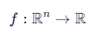

我们希望求解：

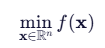

牛顿法迭代公式（多维）：

在第 *k* 次迭代，当前点为 xk，则更新规则为：

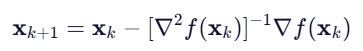

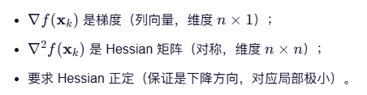

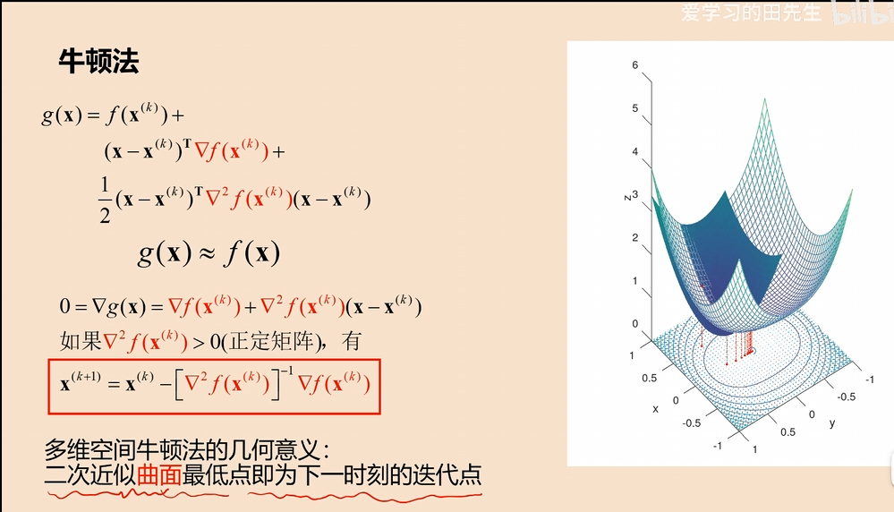

```c++
#include <iostream>
#include <Eigen/Dense>
#include <functional>
#include <cmath>

using Vector = Eigen::VectorXd;
using Matrix = Eigen::MatrixXd;

// 多维无约束牛顿法
Vector newton_multivariate(
    std::function<double(const Vector&)> f,               // 目标函数（可选，用于调试）
    std::function<Vector(const Vector&)> grad_f,          // 梯度 ∇f(x)
    std::function<Matrix(const Vector&)> hess_f,          // Hessian ∇²f(x)
    Vector x0,                                            // 初始点
    double tol = 1e-8,
    int max_iter = 50
) {
    Vector x = x0;

    for (int k = 0; k < max_iter; ++k) {
        Vector g = grad_f(x);
        Matrix H = hess_f(x);

        // 检查梯度是否足够小（收敛）
        if (g.norm() < tol) {
            std::cout << "Converged at iteration " << k << ".\n";
            return x;
        }

        // 求解 H * p = -g
        // 使用 LDLT（适合对称矩阵）或 FullPivLU（通用但慢）
        Eigen::LDLT<Matrix> solver(H);
        if (solver.info() != Eigen::Success || !solver.isPositive()) {
            throw std::runtime_error("Hessian is not positive definite at iteration " + std::to_string(k));
        }

        Vector p = solver.solve(-g);

        // 更新
        x = x + p;

        // 可选：打印中间结果
        // std::cout << "Iter " << k << ": x = " << x.transpose() << ", ||grad|| = " << g.norm() << "\n";
    }

    std::cerr << "Warning: Newton method did not converge within " << max_iter << " iterations.\n";
    return x;
}

// ========================
// 示例：f(x) = (x0 - 1)^2 + 2*(x1 - 2)^2 + 3*(x2 - 3)^2
// 极小值点：[1, 2, 3]^T
// ========================
double example_f(const Vector& x) {
    return (x[0] - 1)*(x[0] - 1) + 2*(x[1] - 2)*(x[1] - 2) + 3*(x[2] - 3)*(x[2] - 3);
}

Vector example_grad(const Vector& x) {
    Vector g(3);
    g[0] = 2 * (x[0] - 1);
    g[1] = 4 * (x[1] - 2);
    g[2] = 6 * (x[2] - 3);
    return g;
}

Matrix example_hess(const Vector& /*x*/) {
    Matrix H(3, 3);
    H << 2, 0, 0,
         0, 4, 0,
         0, 0, 6;
    return H; // 常数正定矩阵
}

int main() {
    // 初始猜测
    Vector x0(3);
    x0 << 0.0, 0.0, 0.0;

    try {
        Vector x_min = newton_multivariate(example_f, example_grad, example_hess, x0);

        std::cout << "Approximate minimizer: x = [" << x_min.transpose() << "]\n";
        std::cout << "Gradient norm at solution: " << example_grad(x_min).norm() << "\n";
    } catch (const std::exception& e) {
        std::cerr << "Error: " << e.what() << std::endl;
    }

    return 0;
}
```

